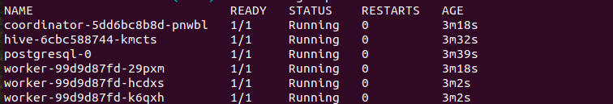
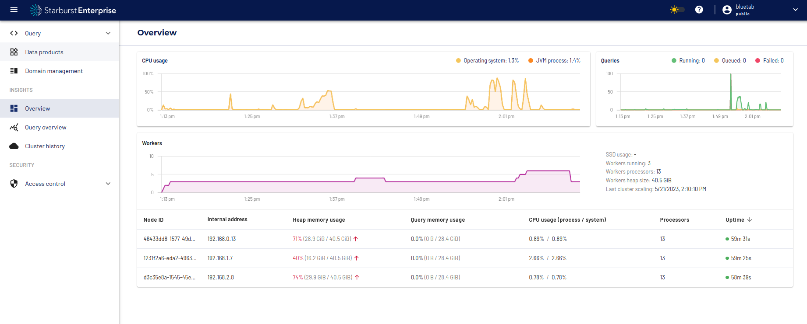

# Introduction

In this new article we are going to talk about one of our partners: [Starburst](https://www.starburst.io/). Starburst is the Enterprise version of[Trino](https://trino.io/) including new integrations, performance improvements, a layer of security and reducing the complexity of management with a user interface that is very easy to use and allows you to make different configurations.
For those of you who don't know Trino is an open-source distributed SQL query engine created in 2012 for Facebook initially under the name Presto. It is designed to query large data sets distributed across one or more heterogeneous data sources. This means that we can query data residing in different storage systems such as HDFS, AWS S3, Google Cloud Storage or Azure Blob Storage. Trino also has the ability to run federated queries that query tables in different data sources such as MySQL, PostgreSQL, Cassandra, Kafka.

With the emerging needs of [Data Mesh](https://martinfowler.com/articles/data-mesh-principles.html) oriented architectures, analytics platforms like  Starburst are becoming more and more important and allow us to centralise and federate different data sources so that we have a single point of entry to our information. With this mentality we can allow our users to access the Starburst platform with different roles and different granularity of access so that they can consult the different domains that companies have. In addition, Starburst is not only for data queries, but also allows us to connect with analytical tools such as [DBT](https://www.getdbt.com/) or [Jupyter Notebook](https://jupyter.org/) or reporting tools such as [Power BI](https://powerbi.microsoft.com/en-au/) to get more out of all our data. But Starburst is not only that, it can also help us in the migration of data to the Cloud, as we can easily connect to the data sources and extract all the information to dump it in any Cloud storage.

To summarize, Starburst is able to analyze all your data, in and around your Data Lake, and it connects to a whole ecosystem. We are going to write a series of articles to deal with the most relevant points, such as the deployment and configuration of the platform, integration with other tools, and user governance and administration. In this first article we are going to focus on the deployment of Starburst in [Kubernetes](https://kubernetes.io/) as well as the configuration that has to be done to connect with the different components of [GCP](https://cloud.google.com/?hl=es-419). We have also added a monitoring layer with [Prometheus](https://prometheus.io/) and [Grafana](https://grafana.com/) where we have published a dashboard with different important metrics in case any company wants to centralise the metrics in Grafana. For all this we are going to rely on a repository that we have created with the infrastructure survey and the installation of Starburst.

## Table of contents

- [Introduction](#introduction)
  - [Table of contents](#table-of-contents)
  - [What do you need to understand this article?](#what-do-you-need-to-understand-this-article)
  - [Architecture](#architecture)
  - [Deployment of infrastructure](#deployment-of-infrastructure)
  - [Starburst installation and configuration](#starburst-installation-and-configuration)
  - [GCP queries and Starburst autoscaling](#gcp-queries-and-starburst-autoscaling)
  - [Metrics](#metrics)
  - [Conclusions](#conclusions)

## What do you need to understand this article?

- Some concepts of [Terraform](https://developer.hashicorp.com/terraform).
- Some concepts of [Kubernetes](https://kubernetes.io/).
- Some concepts of [Helm](https://helm.sh/).
- Some concepts from [Prometheus](https://prometheus.io/).
- Some concepts of [Grafana](https://grafana.com/).
- An account on [GCP](https://console.cloud.google.com/)
- A Starburst license

## Architecture

<p align="center">
  
</p>

As can be seen in the diagram these are the components that will be deployed for the Starburst configuration. As the centrepiece of the deployment we will use [Google Kubernetes Engine](https://cloud.google.com/kubernetes-engine?hl=es-419), this is the managed container orchestration service. We will use Kubernetes as it will make it easier to manage Starburst and we will take advantage of Kubernetes autoscaling to expand the number of Starburst workers and scale in more nodes so we can have more compute resources if we have a peak of work or users.

As an initial configuration of our GKE cluster we will start with a single nodepool for ease of deployment. A nodepool is a grouping of nodes within a cluster with the same configuration and machine type specifications. In our case our nodepool will be called `default-node-pool` and the instance type used will be `e2-standard-16` which is recommended by Starburst as the workload type needs nodes with enough memory. In addition to the Starburst installation we will also deploy both Prometheus and Grafana on the cluster.

As explained above, Starburst is based on Trino, which is a distributed query engine. The main components of Trino are the coordinator and the workers. The Trino coordinator is the component responsible for parsing statements, planning queries and managing the Trino worker nodes. The coordinator tracks the activity of each worker and orchestrates the execution of a query.
The workers are the component responsible for executing tasks and processing data. The worker nodes obtain data from the connectors and exchange intermediate data with each other. The coordinator is responsible for retrieving the results from the workers and returning the final results to the client.

<p align="center">
  
</p>

As transversal components of our architecture we will also deploy a network with a subnet to deploy our GKE cluster, as well as a bucket in Cloud Storage to perform data write tests from Starburst.

In addition, as a component outside the architecture we will have [jmeter](https://jmeter.apache.org/), the tool with which we will perform performance tests to test the elasticity of Starburst and to be able to test the auto-scaling of our cluster.

## Deployment of infrastructure

Once the architecture has been explained, we are going to proceed to deploy all the components, for which we are going to use Terraform as an IaC tool. As important parts of this deployment we will have the most traditional infrastructure part which are the VPCs, the GKE cluster and the Cloud Storage part and on the other hand the components that we will deploy in Kubernetes in a fully automated way which are Grafana and Prometheus.

Let's start with the explanation of the most classic infrastructure. For this deployment we will make use of two modules that are uploaded to github:

- [GKE module](https://github.com/lucasberlang/gcp-gke)
- [VPC module](https://github.com/lucasberlang/gcp-network)

These two modules are invoked in the `main.tf` repository and make use of the Google provider for deployment:

```tf

provider "google" {
  project = var.project_id
  region  = var.region
}

provider "google-beta" {
  project = var.project_id
  region  = var.region
}


module "network" {
  source = "git@github.com:lucasberlang/gcp-network.git?ref=v1.0.0"

  project_id         = var.project_id
  description        = var.description
  enable_nat_gateway = true
  offset             = 1

  intra_subnets = [
    {
      subnet_name           = "private-subnet01"
      subnet_ip_cidr        = "10.0.0.0/24"
      subnet_private_access = false
      subnet_region         = var.region
    }
  ]

  secondary_ranges = {
    private-subnet01 = [
      {
        range_name    = "private-subnet01-01"
        ip_cidr_range = var.ip_range_pods
      },
      {
        range_name    = "private-subnet01-02"
        ip_cidr_range = var.ip_range_services
      },
    ]
  }

  labels = var.labels
}

resource "google_storage_bucket" "gcs_starburst" {
  name          = var.name
  location      = "EU"
  force_destroy = var.force_destroy
}

module "gke-starburst" {
  source = "git@github.com:lucasberlang/gcp-gke.git?ref=v1.1.0"

  project_id              = var.project_id
  name                    = "starburst"
  regional                = true
  region                  = var.region
  network                 = module.network.network_name
  subnetwork              = "go-euw1-bt-stb-private-subnet01-dev"
  ip_range_pods           = "private-subnet01-01"
  ip_range_services       = "private-subnet01-02"
  enable_private_endpoint = false
  enable_private_nodes    = false
  master_ipv4_cidr_block  = "172.16.0.0/28"
  workload_identity       = false
  kubernetes_version      = var.kubernetes_version
  
  gce_persistent_disk_csi_driver = true

  master_authorized_networks = [
    {
      cidr_block   = module.network.intra_subnet_ips.0
      display_name = "VPC"
    },
    {
      cidr_block   = "0.0.0.0/0"
      display_name = "shell"
    }
  ]

  cluster_autoscaling = {
    enabled             = true,
    autoscaling_profile = "BALANCED",
    max_cpu_cores       = 300,
    max_memory_gb       = 940,
    min_cpu_cores       = 24,
    min_memory_gb       = 90,
  }


  node_pools = [
    {
      name         = "default-node-pool"
      machine_type = "e2-standard-16"
      auto_repair  = false
      auto_upgrade = false
    },
  ]
  
  node_labels = {
    "starburstpool" = "default-node-pool"
  }

  istio     = var.istio
  dns_cache = var.dns_cache
  labels    = var.labels
}

```

The only important thing to note is that we are deploying a network with a single subnet and that the GKE cluster is enabled with auto-scaling so that we can increase the number of nodes when there is a workload. We also have to note that a label has been added to all nodes which is `"starburstpool" = "default-node-pool"` which we will make use of later in the Starburst deployment. Apart from these components, we also deployed a Cloud Storage to later configure the Hive connector.

On the other hand, as we have already mentioned, we will also deploy Grafana and Prometheus, for which we will make use of the Helm provider and Terraform's Kubernetes. The deployment of these components can be found in the `helm.tf` file:

```tf
resource "kubernetes_namespace" "prometheus" {
  metadata {
    name = "prometheus"
  }
}

resource "kubernetes_namespace" "grafana" {
  metadata {
    name = "grafana"
  }
}

resource "helm_release" "grafana" {
  chart      = "grafana"
  name       = "grafana"
  namespace  = kubernetes_namespace.grafana.metadata.0.name
  repository = "https://grafana.github.io/helm-charts"

  values = [
    file("templates/grafana.yaml")
  ]
}

resource "kubernetes_secret" "grafana-secrets" {
  metadata {
    name      = "grafana-credentials"
    namespace = kubernetes_namespace.grafana.metadata.0.name
  }
  data = {
    adminUser     = "admin"
    adminPassword = "admin"
  }
}

resource "helm_release" "prometheus" {
  chart      = "prometheus"
  name       = "prometheus"
  namespace  = kubernetes_namespace.prometheus.metadata.0.name
  repository = "https://prometheus-community.github.io/helm-charts"

  values = [
    file("templates/prometheus.yaml")
  ]
}
```

There are several things we have to take into account, these are the settings we have added in the values of each chart. 

First we go to the Prometheus values that we have configured. We've added an extra setting so that it picks up the Starburst metrics once it's up. We have done this in the next part of the configuration:

```yaml
extraScrapeConfigs: |
  - job_name: starburst-monitor
    scrape_interval: 5s
    static_configs:
      - targets: 
        - 'prometheus-coordinator-starburst-enterprise.default.svc.cluster.local:8081'
        - 'prometheus-worker-starburst-enterprise.default.svc.cluster.local:8081'
    metrics_path: /metrics
    scheme: http
```

The only thing to take into account are the targets that we have added, which are basically the services of both the coordinator and the Starburst worker to collect all the metrics.

In the Grafana part we have added both the Prometheus configuration and a dashboard that we have created custom for Starburst, the configuration that we have added is the following:

```yaml
datasources:
 datasources.yaml:
   apiVersion: 1
   datasources:
   - name: Prometheus
     type: prometheus
     url: http://prometheus-server.prometheus.svc.cluster.local
     isDefault: true


dashboards:
  default:
    Starburst-cluster:
      gnetId: 18767
      revision: 1
      datasource: Prometheus
```

In the infra folder of the Github repository you can find all the code needed to perform such a deployment.

## Starburst installation and configuration

Once we have all the infrastructure in place, we will proceed to deploy Starburst on our GKE cluster. To do this we are going to deploy these components:

- Postgres Database on Kubernetes
- Hive Metastore Service
- Starburst Enterprise

The Hive Mestastore service is necessary to configure the Hive connector to be able to access or write to the data stored in Google Cloud Storage. As a backend of our Metastore service we are going to deploy a Postgres database, in order to store all the metadata information in this database. We will also have to configure the Hive service to pass it the Google Cloud credentials so that it has permissions to read and write from GCS. So let's proceed to first declare some environment variables that we will need to download the charts from the Starburst private repository and some more configuration variables that we will need to deploy. These are the variables we are going to need in our deployment:

```bash
export admin_usr=     # Choose an admin user name you will use to login to Starburst & Ranger. Do NOT use 'admin'
export admin_pwd=     # Choose an admin password you will use to login to Starburst & Ranger. MUST be a minimum of 8 characters and contain at least one uppercase, lowercase and numeric value.

export registry_pwd= #Credentials harbor registry
export registry_usr= #Credentials harbor registry
export starburst_license=starburstdata.license #License Starburst
# Zone where the cluster will be deployed. e.g. us-east4-b
export zone="europe-west1"
# Google Cloud Project ID where the cluster is being deployed
export google_cloud_project=
# Google Service account name. The service account is used to access services like GCS and BigQuery, so you should ensure that it has the relevant permissions for these
# Give your cluster a name
export cluster_name=

# These next values are automatically set based on your input values
# We'll automatically get the domain for the zone you are selecting. Comment this out if you don't need DNS
#export google_cloud_dns_zone_name=$(gcloud dns managed-zones describe ${google_cloud_dns_zone:?Zone not set} --project ${google_cloud_project_dns:?Project ID not set} | grep dnsName | awk '{ print $2 }' | sed 's/.$//g')

# This is the public URL to access Starburst
export starburst_url=${cluster_name:?Cluster Name not set}-starburst.${google_cloud_dns_zone_name}
# This is the public URL to access Ranger
export ranger_url=${cluster_name:?Cluster Name not set}-ranger.${google_cloud_dns_zone_name}

# Insights DB details
# These are the defaults if you choose to deploy your postgresDB to the K8s cluster
# You can adjust these to connect to an external DB, but be advised that the nodes in the K8s cluster must have access to the URL
export database_connection_url=jdbc:postgresql://postgresql:5432/insights
export database_username=
export database_password=

# Data Products. Leave the password unset as below, if you are connecting directly to the coordinator on port 8080
export data_products_enabled=true
export data_products_jdbc_url=jdbc:trino://coordinator:8080
export data_products_username=${admin_usr}
export data_products_password=

# Starburst Access Control
export starburst_access_control_enabled=true
export starburst_access_control_authorized_users=${admin_usr}

# These last remaining values are static
export xtra_args_hive="--set objectStorage.gs.cloudKeyFileSecret=service-account-key"
export xtra_args_starburst="--values starburst.catalog.yaml"
export xtra_args_ranger=""
```

Once we have defined our environment variables, we will proceed to create a Kubernetes secret to configure the credentials with which Hive will connect to GCS.

```bash
kubectl create secret generic service-account-key --from-file key.json
```

As a previous step, we have created a service account with permissions in Cloud Storage and Bigquery and we have downloaded the credentials of that service account. Also as a previous step we will add the Helm repository with the following command:

```bash
helm repo add --username ${registry_usr} --password ${registry_pwd} starburstdata https://harbor.starburstdata.net/chartrepo/starburstdata
helm repo add bitnami https://charts.bitnami.com/bitnami
```

Once we have the previous configuration done we will proceed to deploy the Postgres service first and then the Hive Metastore service. To do this we will use Helm. For the postgres deployment we will use the following command:

```bash
helm upgrade postgres bitnami/postgresql --install --values postgres.yaml \
    --version 12.1.6 \
    --set primary.nodeSelector.starburstpool=default-node-pool \
    --set readReplicas.nodeSelector.starburstpool=default-node-pool
```

There are several things to note about the above command. The first thing is that the postgres deployment will be done on the nodes that have the `starburstpool=default-node-pool` tag, which in our case is our default worker pool. We will use postgres version 12.1.6 and the configuration we have added in postgres is as follows:

```yaml
fullnameOverride: postgresql

global:
  postgresql:
    auth:
      database: postgres
      username: postgres
      postgresPassword: ****
  storageClass: "standard"
primary:
  initdb:
    scripts:
      init.sql: |
        create database hive;
        create database ranger;
        create database insights;
        create database datacache;

service:
  type: ClusterIP
```

This information is found in the `postgres.yaml` file and will configure the postgres username and password and create 4 databases that Starburst uses internally as a backend. In our case as you can see we have configured the backend service in the same cluster as the Starburst configuration but this can be configured outside the Kubernetes cluster for production environments, basically we could have a managed service such as Cloud Sql to avoid problems in production.

Now let's proceed with the deployment of the Hive Metastore service, we will do this with the following command:

```bash
helm upgrade hive starburstdata/starburst-hive --install --values hive.yaml \
    --set registryCredentials.username=${registry_usr:?Value not set} \
    --set registryCredentials.password=${registry_pwd:?Value not set} \
    --set nodeSelector.starburstpool=default-node-pool  \
    --set objectStorage.gs.cloudKeyFileSecret=service-account-key
```

Here we have to take into account several important things, the first one is that as in the postgres service the deployment is going to be done on the nodes with the tag `starburstpool=default-node-pool`. The second important part is that we have done the configuration of the Google credentials for the hive connector to work, we have done this with the following command: `--set objectStorage.gs.cloudKeyFileSecret=service-account-key`. With this we mount the credentials file as a file in the Hive deployment so that it has visibility in the credentials. The extra values we have added to the hive configuration can be found in the `hive.yaml` file and are as follows:

```yaml
database:
  external:
    driver: org.postgresql.Driver
    jdbcUrl: jdbc:postgresql://postgresql:5432/hive
    user: #user postgres
    password: #password postgres
  type: external

expose:
  type: clusterIp

image:
  repository: harbor.starburstdata.net/starburstdata/hive

registryCredentials:
  enabled: true
  registry: harbor.starburstdata.net/starburstdata
```

Once we have deployed both the Postgres and Hive Metastore services, we can proceed to deploy Starburst. In order to do so, we will need to take a series of steps. The first step is to create a Kubernetes secret with the Starburst license, the second step is to create a secret with the environment variables that we have defined before, we will do this with a small script to remove complexity and to take the variables that we have already defined. With the following command we will proceed to perform the previous steps:

```bash
kubectl create secret generic starburst --from-file ${starburst_license}
chmod 755 load_secrets.sh && . ./load_secrets.sh
kubectl apply -f secrets.yaml
```

Now that we have the previous configurations we will proceed to deploy Starburst with the following command:

```bash
helm upgrade starburst-enterprise starburstdata/starburst-enterprise --install --values starburst.yaml \
    --set sharedSecret="$(openssl rand 64 | base64)" \
    --set coordinator.resources.requests.memory=$(echo $(( $(kubectl get nodes --selector='starburstpool=default-node-pool' -o jsonpath='{.items[0].status.allocatable.memory}' | awk -F "Ki" '{ print $1 }')*10/100 ))Ki) \
    --set coordinator.resources.requests.cpu=$(echo $(( $(kubectl get nodes --selector='starburstpool=default-node-pool' -o jsonpath='{.items[0].status.allocatable.cpu}' | awk -F "m" '{ print $1 }')*10/100 ))m) \
    --set coordinator.resources.limits.memory=$(echo $(( $(kubectl get nodes --selector='starburstpool=default-node-pool' -o jsonpath='{.items[0].status.allocatable.memory}' | awk -F "Ki" '{ print $1 }')*10/100 ))Ki) \
    --set coordinator.resources.limits.cpu=$(echo $(( $(kubectl get nodes --selector='starburstpool=default-node-pool' -o jsonpath='{.items[0].status.allocatable.cpu}' | awk -F "m" '{ print $1 }')*10/100 ))m) \
    --set worker.resources.requests.memory=$(echo $(( $(kubectl get nodes --selector='starburstpool=default-node-pool' -o jsonpath='{.items[0].status.allocatable.memory}' | awk -F "Ki" '{ print $1 }') - 10500000 ))Ki) \
    --set worker.resources.requests.cpu=$(echo $(( $(kubectl get nodes --selector='starburstpool=default-node-pool' -o jsonpath='{.items[0].status.allocatable.cpu}' | awk -F "m" '{ print $1 }') - 3500 ))m) \
    --set worker.resources.limits.memory=$(echo $(( $(kubectl get nodes --selector='starburstpool=default-node-pool' -o jsonpath='{.items[0].status.allocatable.memory}' | awk -F "Ki" '{ print $1 }') - 10500000 ))Ki) \
    --set worker.resources.limits.cpu=$(echo $(( $(kubectl get nodes --selector='starburstpool=default-node-pool' -o jsonpath='{.items[0].status.allocatable.cpu}' | awk -F "m" '{ print $1 }') - 3500 ))m) \
    --set coordinator.nodeSelector.starburstpool=default-node-pool 
```

As you can see there are several things to take into account here. The first one is that all the Starburst components that are deployed are deployed in the nodes with the tag `starburstpool=default-node-pool`, this is just to reduce the complexity of the demo, in productive environments a good practice would be to have a nodepool for the coordinator and another nodepool for the Starburst workers. Another thing to keep in mind is the memory and cpu configuration that is done on both the workers and the coordinator. As a best practice Starburst recommends that there should be one worker pod for each node that is deployed in our Kubernetes cluster, so what we have done is to adjust the memory and cpu of our pods to the size of the machine we have. Finally there are the configuration values that we have used in the Starburst deployment, these can be found in the `starburst.yaml` file and are as follows:

```yaml
catalogs:
  hive: |
    connector.name=hive
    hive.security=starburst
    hive.metastore.uri=thrift://hive:9083
    hive.gcs.json-key-file-path=/gcs-keyfile/key.json
    hive.gcs.use-access-token=false
  postgres: |
    connector.name=postgresql
    connection-url=jdbc:postgresql://postgresql:5432/insights
    connection-user=******
    connection-password=******
  bigquery: |
      connector.name=bigquery
      bigquery.project-id=******
      bigquery.credentials-file=/gcs-keyfile/key.json
prometheus:
  enabled: true
  agent:
    version: "0.16.1"
    port: 8081
    config: "/etc/starburst/telemetry/prometheus.yaml"
  rules:
    - pattern: trino.execution<name=QueryManager><>(running_queries|queued_queries)
      name: $1
      attrNameSnakeCase: true
      type: GAUGE
    - pattern: 'trino.execution<name=QueryManager><>FailedQueries\.TotalCount'
      name: 'starburst_failed_queries'
      type: COUNTER
    - pattern: 'trino.execution<name=QueryManager><>(running_queries)'
      name: 'starburst_running_queries'
    - pattern: 'trino.execution<name=QueryManager><>StartedQueries\.FiveMinute\.Count'
      name: 'starburst_started_queries'
    - pattern: 'trino.execution<name=SqlTaskManager><>InputPositions\.FiveMinute\.Count'
      name: 'starburst_input_rows'
    - pattern: 'trino.execution<name=SqlTaskManager><>InputDataSize\.FiveMinute\.Count'
      name: 'starburst_input_data_bytes'
    - pattern: 'trino.execution<name=QueryManager><>UserErrorFailures\.FiveMinute\.Count'
      name: 'starburst_failed_queries_user'
    - pattern: 'trino.execution<name=QueryManager><>ExecutionTime\.FiveMinutes\.P50'
      name: 'starburst_latency_p50'
    - pattern: 'trino.execution<name=QueryManager><>WallInputBytesRate\.FiveMinutes\.P90'
      name: 'starburst_latency_p90'
    - pattern: 'trino.failuredetector<name=HeartbeatFailureDetector><>ActiveCount'
      name: 'starburst_active_node'
    - pattern: 'trino.memory<type=ClusterMemoryPool, name=general><>FreeDistributedBytes'
      name: 'starburst_free_memory_pool'
    - pattern: 'trino.memory<name=ClusterMemoryManager><>QueriesKilledDueToOutOfMemory'
      name: 'starburst_queries_killed_due_to_out_of_memory'
    - pattern: 'java.lang<type=Memory><HeapMemoryUsage>committed'
      name: 'starburst_heap_size_usage'
    - pattern: 'java.lang<type=Threading><>ThreadCount'
      name: 'starburst_thread_count'
coordinator:
  envFrom:
  - secretRef:
      name: environment-vars
  additionalProperties: |
    starburst.data-product.enabled=${ENV:data_products_enabled}
    data-product.starburst-jdbc-url=${ENV:data_products_jdbc_url}
    data-product.starburst-user=${ENV:data_products_username}
    data-product.starburst-password=
    query.max-memory=1PB
    starburst.access-control.enabled=${ENV:starburst_access_control_enabled}
    starburst.access-control.authorized-users=${ENV:starburst_access_control_authorized_users}
  etcFiles:
    properties:
      config.properties: |
        coordinator=true
        node-scheduler.include-coordinator=false
        http-server.http.port=8080
        discovery-server.enabled=true
        discovery.uri=http://localhost:8080
        usage-metrics.cluster-usage-resource.enabled=true
        http-server.authentication.allow-insecure-over-http=true
        web-ui.enabled=true
        http-server.process-forwarded=true
        insights.persistence-enabled=true
        insights.metrics-persistence-enabled=true
        insights.jdbc.url=${ENV:database_connection_url}
        insights.jdbc.user=${ENV:database_username}
        insights.jdbc.password=${ENV:database_password}
      password-authenticator.properties: |
        password-authenticator.name=file
  nodeSelector:
    starburstpool: default-node-pool
  resources:
    limits:
      cpu: 2
      memory: 12Gi
    requests:
      cpu: 2
      memory: 12Gi

expose:
  type: clusterIp
  ingress:
    serviceName: starburst
    servicePort: 8080
    host: 
    path: "/"
    pathType: Prefix
    tls:
      enabled: true
      secretName: tls-secret-starburst
    annotations:
      kubernetes.io/ingress.class: nginx
      cert-manager.io/cluster-issuer: letsencrypt

registryCredentials:
  enabled: true
  password: ******
  registry: harbor.starburstdata.net/starburstdata
  username: ******

starburstPlatformLicense: starburst

userDatabase:
  enabled: true
  users:
  - password: ******
    username: ******

worker:
  envFrom:
  - secretRef:
      name: environment-vars
  autoscaling:
    enabled: true
    maxReplicas: 10
    minReplicas: 3
    targetCPUUtilizationPercentage: 40
  deploymentTerminationGracePeriodSeconds: 30
  nodeSelector:
    starburstpool: default-node-pool
  resources:
    limits:
      cpu: 8
      memory: 40Gi
    requests:
      cpu: 8
      memory: 40Gi
  starburstWorkerShutdownGracePeriodSeconds: 120
  tolerations:
    - key: "kubernetes.azure.com/scalesetpriority"
      operator: "Exists"
      effect: "NoSchedule"

additionalVolumes:
  - path: /gcs-keyfile/key.json
    subPath: key.json
    volume:
      configMap:
        name: "sa-key"
```

In this configuration there are several values to take into account which are the part of catalogs, prometheus, worker and additionalVolumes.

Let's start by explaining the catalogs part. For those who don't know, a catalogue in Starburst is the configuration that allows access to specific data sources. Each Starburst cluster can have multiple catalogues configured and, therefore, allow access to different data sources. In our case, we have defined the Hive, Postgres and Bigquery catalogue to be able to access these data sources:

```yaml
catalogs:
  hive: |
    connector.name=hive
    hive.security=starburst
    hive.metastore.uri=thrift://hive:9083
    hive.gcs.json-key-file-path=/gcs-keyfile/key.json
    hive.gcs.use-access-token=false
  postgres: |
    connector.name=postgresql
    connection-url=jdbc:postgresql://postgresql:5432/insights
    connection-user=******
    connection-password=******
  bigquery: |
      connector.name=bigquery
      bigquery.project-id=******
      bigquery.credentials-file=/gcs-keyfile/key.json
```

The second configuration to take into account is Prometheus, we do this to expose certain metrics to prometheus and to be able to extract relevant information in a Grafana dashboard, for this we have the following configuration:

```yaml
prometheus:
  enabled: true
  agent:
    version: "0.16.1"
    port: 8081
    config: "/etc/starburst/telemetry/prometheus.yaml"
  rules:
    - pattern: trino.execution<name=QueryManager><>(running_queries|queued_queries)
      name: $1
      attrNameSnakeCase: true
      type: GAUGE
    - pattern: 'trino.execution<name=QueryManager><>FailedQueries\.TotalCount'
      name: 'starburst_failed_queries'
      type: COUNTER
    - pattern: 'trino.execution<name=QueryManager><>(running_queries)'
      name: 'starburst_running_queries'
    - pattern: 'trino.execution<name=QueryManager><>StartedQueries\.FiveMinute\.Count'
      name: 'starburst_started_queries'
    - pattern: 'trino.execution<name=SqlTaskManager><>InputPositions\.FiveMinute\.Count'
      name: 'starburst_input_rows'
    - pattern: 'trino.execution<name=SqlTaskManager><>InputDataSize\.FiveMinute\.Count'
      name: 'starburst_input_data_bytes'
    - pattern: 'trino.execution<name=QueryManager><>UserErrorFailures\.FiveMinute\.Count'
      name: 'starburst_failed_queries_user'
    - pattern: 'trino.execution<name=QueryManager><>ExecutionTime\.FiveMinutes\.P50'
      name: 'starburst_latency_p50'
    - pattern: 'trino.execution<name=QueryManager><>WallInputBytesRate\.FiveMinutes\.P90'
      name: 'starburst_latency_p90'
    - pattern: 'trino.failuredetector<name=HeartbeatFailureDetector><>ActiveCount'
      name: 'starburst_active_node'
    - pattern: 'trino.memory<type=ClusterMemoryPool, name=general><>FreeDistributedBytes'
      name: 'starburst_free_memory_pool'
    - pattern: 'trino.memory<name=ClusterMemoryManager><>QueriesKilledDueToOutOfMemory'
      name: 'starburst_queries_killed_due_to_out_of_memory'
    - pattern: 'java.lang<type=Memory><HeapMemoryUsage>committed'
      name: 'starburst_heap_size_usage'
    - pattern: 'java.lang<type=Threading><>ThreadCount'
      name: 'starburst_thread_count'
```

In the configuration of the workers we are going to activate the auto-scaling of these pods, for this we are going to make a configuration so that there is a minimum of 3 pods workers that will translate into 3 nodes in our GKE cluster and a maximum of 10 pods. For the autoscaling we are going to use the CPU consumption metric. The values are as follows:

```yaml
worker:
  envFrom:
  - secretRef:
      name: environment-vars
  autoscaling:
    enabled: true
    maxReplicas: 10
    minReplicas: 3
    targetCPUUtilizationPercentage: 40
```

Finally, we will add an additional volume to our deployment to be able to mount the Google cloud credentials on both the coordinator and the workers, we will do this as follows:

```yaml
additionalVolumes:
  - path: /gcs-keyfile/key.json
    subPath: key.json
    volume:
      configMap:
        name: "sa-key"
```

With all these steps we would have our Starburst cluster up and running.

<p align="center">
  
</p>

<p align="center">
  
</p>

## GCP queries and Starburst autoscaling

Once the Starburst cluster is up, we are going to run some queries to test its performance and operation. To do this we are going to perform read queries on the [TPCH](https://www.tpc.org/tpch/) schema and then we are also going to write the output of these queries to the Google bucket that we created in the deployment steps. The queries we are going to run are located in the queries folder in the `tpch.sql` and `gcs_storage.sql` files.

To launch the queries it will be as simple as going to the queries section of the web interface and executing the first queries in the `tpch.sql` file:

```sql
 CREATE SCHEMA hive.logistic WITH (location = 'gs://starburst-bluetab-test/logistic');

CREATE VIEW "hive"."logistic"."shipping_priority" SECURITY DEFINER AS
SELECT
  l.orderkey
, SUM((l.extendedprice * (1 - l.discount))) revenue
, o.orderdate
, o.shippriority
FROM
  tpch.tiny.customer c
, tpch.tiny.orders o
, tpch.tiny.lineitem l
WHERE ((c.mktsegment = 'BUILDING') AND (c.custkey = o.custkey) AND (l.orderkey = o.orderkey))
GROUP BY l.orderkey, o.orderdate, o.shippriority
ORDER BY revenue DESC, o.orderdate ASC;


CREATE VIEW "hive"."logistic"."minimum_cost_supplier" SECURITY DEFINER AS
SELECT
  s.acctbal
, s.name SupplierName
, n.name Nation
, p.partkey
, p.mfgr
, s.address
, s.phone
, s.comment
FROM
  tpch.tiny.part p
, tpch.tiny.supplier s
, tpch.tiny.partsupp ps
, tpch.tiny.nation n
, tpch.tiny.region r
WHERE ((p.partkey = ps.partkey) AND (s.suppkey = ps.suppkey) AND (p.size = 15) AND (p.type LIKE '%BRASS') AND (s.nationkey = n.nationkey) AND (n.regionkey = r.regionkey) AND (r.name = 'EUROPE') AND (ps.supplycost = (SELECT MIN(ps.supplycost)
FROM
  tpch.tiny.partsupp ps
, tpch.tiny.supplier s
, tpch.tiny.nation n
, tpch.tiny.region r
WHERE ((p.partkey = ps.partkey) AND (s.suppkey = ps.suppkey) AND (s.nationkey = n.nationkey) AND (n.regionkey = r.regionkey) AND (r.name = 'EUROPE'))
)))
ORDER BY s.acctbal DESC, n.name ASC, s.name ASC, p.partkey ASC;


select
  cst.name as CustomerName,
  cst.address,
  cst.phone,
  cst.nationkey,
  cst.acctbal as BookedOrders,
  cst.mktsegment,
  nat.name as Nation,
  reg.name as Region
from tpch.sf1.customer as cst
join tpch.sf1.nation as nat on nat.nationkey = cst.nationkey
join tpch.sf1.region as reg on reg.regionkey = nat.regionkey
where reg.regionkey = 1;

select
  nat.name as Nation,
  avg(cst.acctbal) as average_booking
from tpch.sf100.customer as cst
join tpch.sf100.nation as nat on nat.nationkey = cst.nationkey
join tpch.sf100.region as reg on reg.regionkey = nat.regionkey
where reg.regionkey = 1
group by nat.name;
```

<p align="center">
  
</p>

In these tests we will create a series of views and we will make some selects with several crosses over the customer(15000000 rows), nation(25 rows) and region(5 rows) tables of the sf100 schema to check that everything works correctly and to see that we have our platform operational. Once we have checked that everything is correct we will try to write some results in the bucket we have created. To do this we will launch the queries found in the `gcs_storage.sql` file:

```sql
CREATE SCHEMA hive.datalake WITH (location = 'gs://starburst-bluetab-test/datalake');

create table hive.datalake.customer WITH (format = 'ORC') as select * from tpch.sf100.customer;
create table hive.datalake.orders WITH (format = 'Parquet') as select * from tpch.sf100.orders;
create table hive.datalake.supplier WITH (format = 'ORC') as select * from tpch.sf100.supplier;
create table hive.datalake.nation WITH (format = 'ORC') as select * from tpch.sf100.nation;
create table hive.datalake.region as select * from tpch.sf100.region;

CREATE TABLE hive.datalake.region_external (
  regionkey bigint, name varchar(25), comment varchar(152)
)
WITH (
  external_location='gs://starburst-bluetab-test/datalake/region',
  format='orc'
);

select * from hive.datalake.region_external;

CREATE TABLE hive.datalake.partitioned_nation
WITH (
  partitioned_by = ARRAY['nationkey']
)
AS SELECT name, comment, regionkey, nationkey FROM tpch.sf1.nation;

select * from hive.datalake.partitioned_nation;

select * from hive.datalake.customer;
select count(*) from hive.datalake.orders;

select
    s.*,
    n.name as nation,
    r.name as region
from
    hive.datalake.supplier s
    join hive.datalake.nation n on s.nationkey = n.nationkey
    join hive.datalake.region r on r.regionkey = n.regionkey
    where r.name='EUROPE';

select
    r.name as region,
    sum(s.acctbal) as total_account_balance
from
    hive.datalake.supplier s
    join hive.datalake.nation n on s.nationkey = n.nationkey
    join hive.datalake.region r on r.regionkey = n.regionkey
group by r.name
order by total_account_balance;
```

In this test the most relevant thing is that we are going to write the data from the tables customer(15000000 rows), orders(150000000 rows), supplier(1000000 rows), nation(25 rows) and region(5 rows) in our gcs bucket. As we said before Starburst is not only a tool that allows you to launch queries to analyse data but it can also help you in your company's data migrations by dumping the information from your database to your cloud platform. A very important thing to keep in mind is that Starburst allows you to work with different file types, being able to write your final tables in ORC, Parquet or formats such as Delta or Hudi giving you a very wide freedom in the cloud migrations.

<p align="center">
  
</p>

As a last test to see that everything is working correctly we are going to launch a query to federate different data from different sources, in our case we will federate data from the previous table that we have created in Google Cloud Storage called customer with a table called nation that we will create in the postgres that we have configured in our deployment and the region table that is in the tcph schema. This query can be found in the `federate.sql` file:

```sql
create schema postgres.logistic;
create table postgres.logistic.nation as select * from tpch.sf1.nation;

select
  cst.name as CustomerName,
  cst.address,
  cst.phone,
  cst.nationkey,
  cst.acctbal as BookedOrders,
  cst.mktsegment,
  nat.name as Nation,
  reg.name as Region
from hive.datalake.customer as cst
join postgres.logistic.nation as nat on nat.nationkey = cst.nationkey
join tpch.sf1.region as reg on reg.regionkey = nat.regionkey
where reg.regionkey = 1;
```

This type of queries is one of Starburst's strong points, being able to federate queries that are in different information silos without the need to migrate the data and being able to attack different Cloud or onpremise information.

OK, once we have tested that both queries and writes in GCS work correctly we are going to run some performance tests to simulate users in parallel and see how our platform auto-scales. To do this we are going to configure jmeter for these tests. To do this we have had to configure the trino jdbc connector to send queries to our cluster. The users we are going to simulate are 20 users in parallel, each one launching a sequence of 5 queries. This means that there will be 20 queries in parallel at the same time which in a real scenario will simulate much more than 20 users as they normally don't all launch queries at the same time. The queries we are going to run are as follows:

```sql
select
  cst.name as CustomerName,
  cst.address,
  cst.phone,
  cst.nationkey,
  cst.acctbal as BookedOrders,
  cst.mktsegment,
  nat.name as Nation,
  reg.name as Region
from tpch.sf1.customer as cst
join tpch.sf1.nation as nat on nat.nationkey = cst.nationkey
join tpch.sf1.region as reg on reg.regionkey = nat.regionkey
where reg.regionkey = 1;

SELECT
  s.acctbal
, s.name SupplierName
, n.name Nation
, p.partkey
, p.mfgr
, s.address
, s.phone
, s.comment
FROM
  tpch.tiny.part p
, tpch.tiny.supplier s
, tpch.tiny.partsupp ps
, tpch.tiny.nation n
, tpch.tiny.region r
WHERE ((p.partkey = ps.partkey) AND (s.suppkey = ps.suppkey) AND (p.size = 15) AND (p.type LIKE '%BRASS') AND (s.nationkey = n.nationkey) AND (n.regionkey = r.regionkey) AND (r.name = 'EUROPE') AND (ps.supplycost = (SELECT MIN(ps.supplycost)
FROM
  tpch.tiny.partsupp ps
, tpch.tiny.supplier s
, tpch.tiny.nation n
, tpch.tiny.region r
WHERE ((p.partkey = ps.partkey) AND (s.suppkey = ps.suppkey) AND (s.nationkey = n.nationkey) AND (n.regionkey = r.regionkey) AND (r.name = 'EUROPE'))
)))
ORDER BY s.acctbal DESC, n.name ASC, s.name ASC, p.partkey ASC;

SELECT
count(*)
FROM
  tpch.sf1.customer c
, tpch.sf1.orders o
, tpch.sf1.lineitem l
WHERE ((c.mktsegment = 'BUILDING') AND (c.custkey = o.custkey) AND (l.orderkey = o.orderkey))
GROUP BY l.orderkey, o.orderdate, o.shippriority
ORDER BY o.orderdate ASC;
```

<p align="center">
  
</p>

If we look at our Kubernetes cluster we can see that more Starburst workers are being raised at the moment of high demand in our simulation:

<p align="center">
  
</p>

<p align="center">
  
</p>

This is one of the most convenient and important features that Starburst gives us as it makes our data analytics platform 100% elastic and we can adapt to the peaks of demand we have.

## Metrics

Finally, Starburst provides us with an interface where we can visualise certain metrics of our cluster consumption, such as memory, cpu or queries made in real time in our cluster.

<p align="center">
  
</p>

In addition to these metrics we have also added Prometheus and Grafana deployment to our configuration to integrate with the most common tools within any organisation. The metrics we have added to Grafana are memory consumption of our Starburst cluster, queries made by users, queries with errors, total memory of our Kubernetes cluster and active workers. Once these metrics have been integrated, the dashboard we would have would be as follows:

<p align="center">
  
</p>

Once integrated with Grafana we could create alerts to send messages in case there is a problem in our Starburst cluster and thus have all the operations flow covered to avoid headaches if there is any kind of incident or unavailability. The dashboard is published in [Grafana](https://grafana.com/grafana/dashboards/18767-starburst-k8s/) so that anyone can use it.

## Conclusions

For some years now, large corporations have faced a common challenge when trying to share and analyse information across departments, as each department stores and manages its data in isolation. These silos make it difficult to access and integrate data, preventing a complete and unified view of business information. The lack of interoperability between data silos hinders informed decision making, slows down analytical processes and limits the ability of organisations to gain a competitive advantage. If your organisation finds itself in a similar situation Starburst is the tool for you.

Starburst makes it easy to access and analyse all these silos of information and gives you the ability to federate data from multiple sources and locations, whether it's data in the cloud or in your onpremise datacenter. It enables real-time queries without the need to move or transform data beforehand. This streamlines the analytical process and gives organisations a 360-degree view of their data. In addition, it not only helps you to consult data from different sources but it can also help you in your migrations to the Cloud as it allows you to consult any source and dump this information in a storage such as s3 or gcs in open file format such as parquet.

One of the main advantages of Starburst is that it allows you to deploy the infrastructure on Kubernetes to take advantage of its full potential. Kubernetes gives you the ability to dynamically adapt to the workload. With this feature, Starburst clusters can automatically increase or decrease the number of workers according to demand. This allows you to optimise resource usage and ensure optimal performance, as additional pods are created when the load increases and removed when the load decreases. This is a very important point within any organisation as it improves operational efficiency by minimising downtime and unnecessary costs, while ensuring constant availability and agile response to peak workloads. Also, one thing to note is that you can install Starburst on either Cloud or onpremise.

Apart from all this, it also allows you to have a role and governance of users within your platform, giving a granularity at the level of access to data to each user, allowing you to create roles for certain schemas, tables or even columns and rows within a table.

In conclusion, Starburst is a tool to consider if you want to take your organisation to the next level in the data world, or if you are considering a data strategy with a more data mesh-oriented vision and philosophy.
